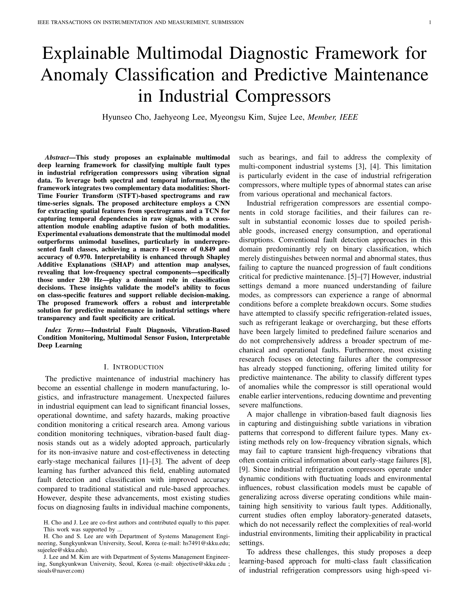

# Paper
Explainable Multimodal Diagnostic Framework for Anomaly Classification and Predictive Maintenance in Industrial Compressors

## 📁 Directory Structure

```
.
├── shap_attention_results/       # SHAP 및 Attention Map 결과 (2번 코드 결과)
├── final_results/                # 모델별 5회 실험 평가 결과 (multimodal / 1D / 2D)
├── figures/                      # 논문 수록용 시각화 결과 (3번 코드 결과)
├── test_raw/                     # 테스트용 raw 파일 저장 폴더
├── 1. data_split_and_preprocess.ipynb  # 데이터 전처리 및 분할 코드
├── 2. main_code.ipynb                  # 모델 학습 및 평가 코드
└── 3. visualize.ipynb                  # 시각화 및 결과 해석 코드
(현재 데이터는 용량 문제로 첨부하지 않음)
```

## 📄 Code Overview

### `1. data_split_and_preprocess.ipynb`
- 압축기(compressor) 진동 데이터를 전처리하고, 훈련, 검증, 테스트 데이터셋으로 분할
- 데이터 전처리: CSV 형식의 Raw 데이터를 STFT(Short-Time Fourier Transform) 이미지와 Raw 신호로 변환
- 윈도우 생성: 데이터를 '원자(atoms)' 단위로 그룹화한 후, 슬라이딩 윈도우를 생성
- 데이터 증강: 데이터가 부족한 'abnormal_1'과 'abnormal_2' 클래스의 훈련 데이터에 노이즈, 시프트, 스케일링 기법을 적용해 증강
- 데이터 분할: 전체 데이터를 20초 단위의 블록으로 나눈 뒤, 각 블록을 훈련(60%), 검증(20%), 테스트(20%) 세트로 분할
- 결과 저장: 전처리된 STFT 이미지와 Raw 신호, 그리고 메타데이터를 각각 .npy 및 .csv 파일로 저장

### `2. main_code.ipynb`
- 모델 정의: 2D CNN과 1D TCN(Temporal ConvNet)을 결합한 멀티모달 모델 및 유니모달 모델(2D CNN, 1D TCN) 아키텍처 정의.
- Cross Attention 적용: STFT와 Raw 신호 간 상호작용을 포착하기 위해 교차 어텐션 메커니즘 통합.
- 손실 함수: 클래스 불균형 문제를 해결하기 위해 Focal Loss 사용.
- 학습 및 평가:  모델별 5회 학습 후 성능 저장, Macro F1 점수 기준의 조기 종료를 포함한 모델 학습 및 성능 평가.
- 모델 해석: SHAP과 어텐션 맵을 계산하여 모델 예측에 대한 설명력 확보.
- 결과 저장: 각 실험의 지표(F1, 정확도 등)와 모델 해석 결과(SHAP, 어텐션 맵)를 저장.

### `3. visualize.ipynb`
- 대표 시계열 샘플에 대한 모델 해석 시각화
- 각 class별 raw shap, stft shap, attention map 결과 시각화


## Paper

